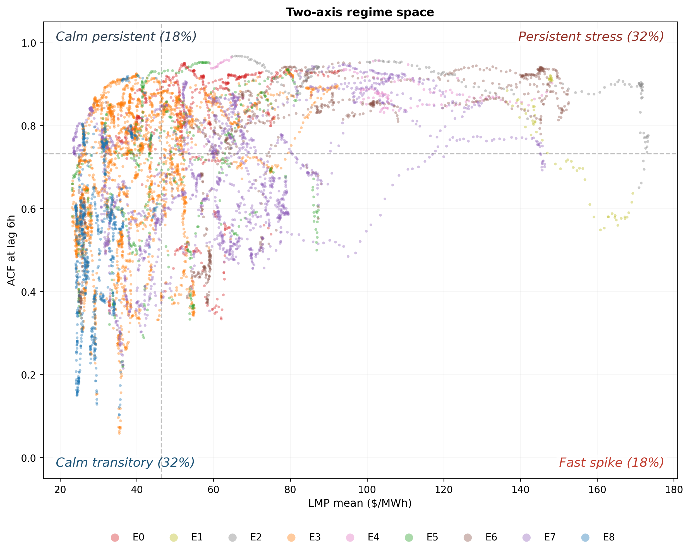
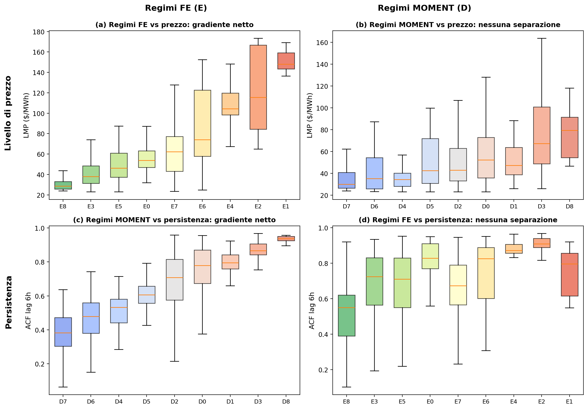
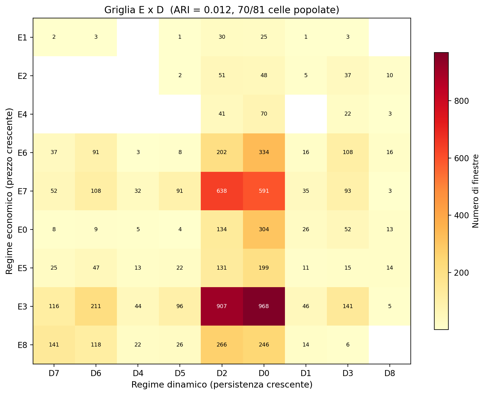
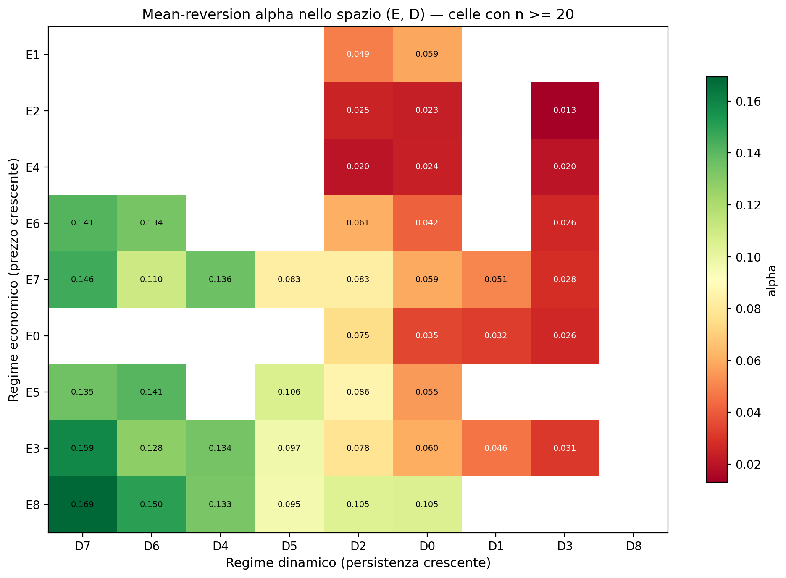
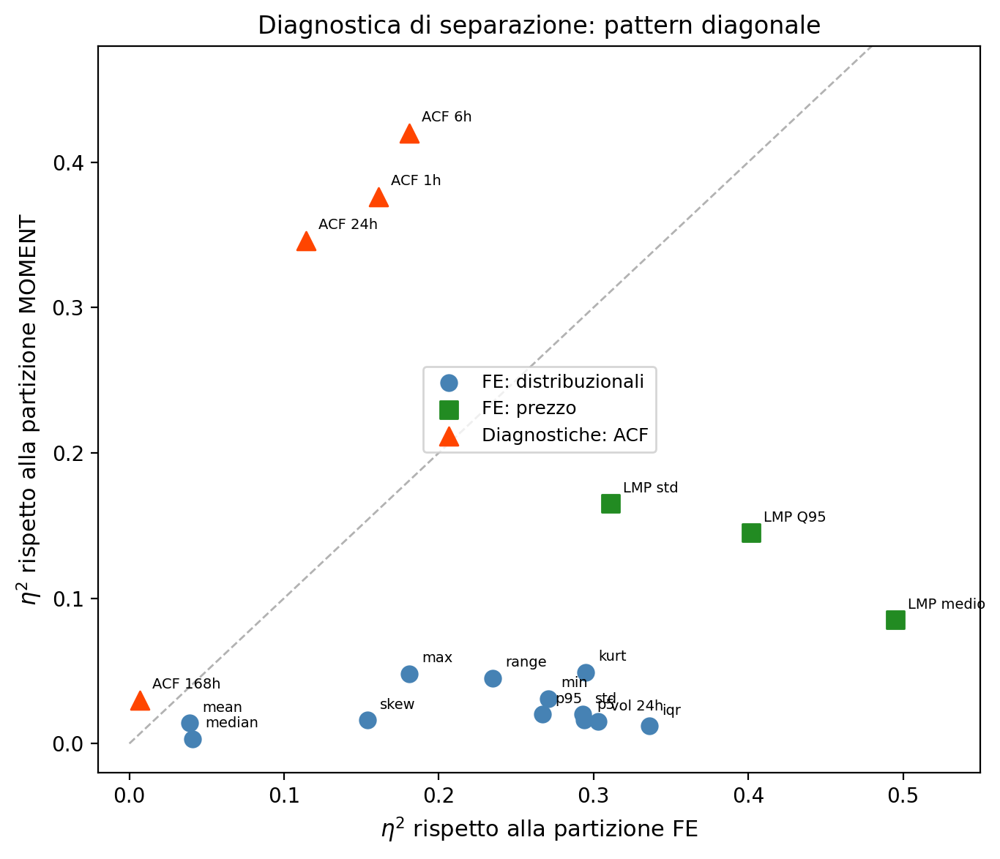
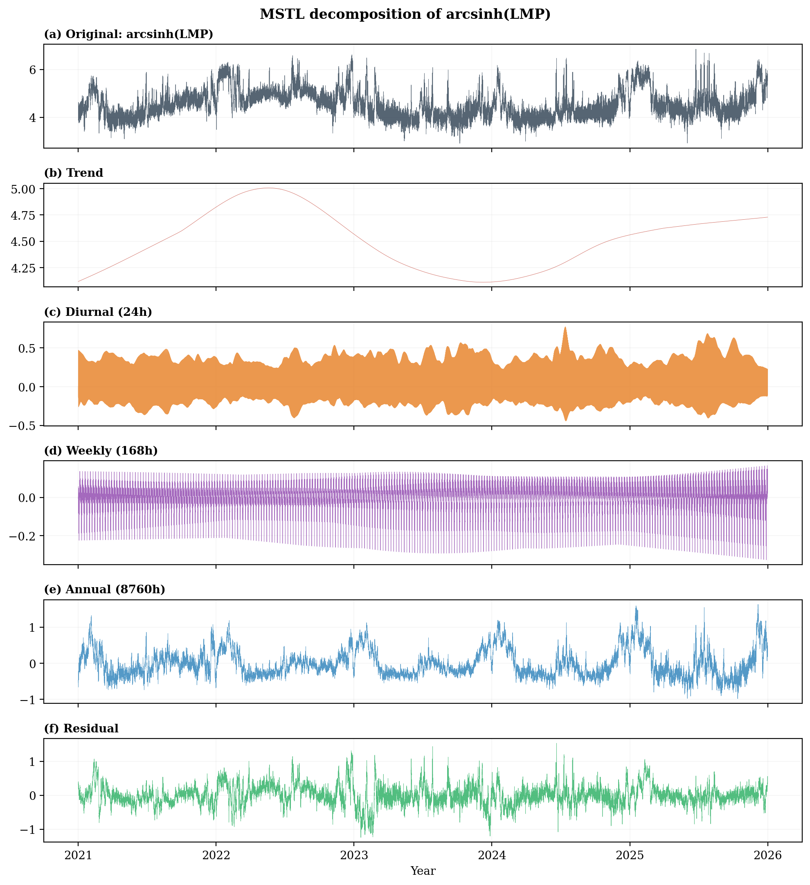
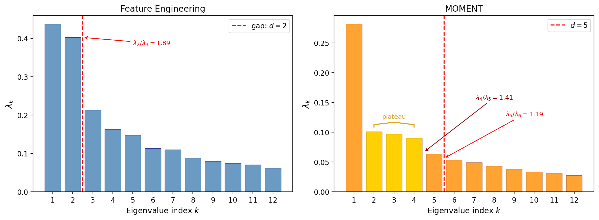
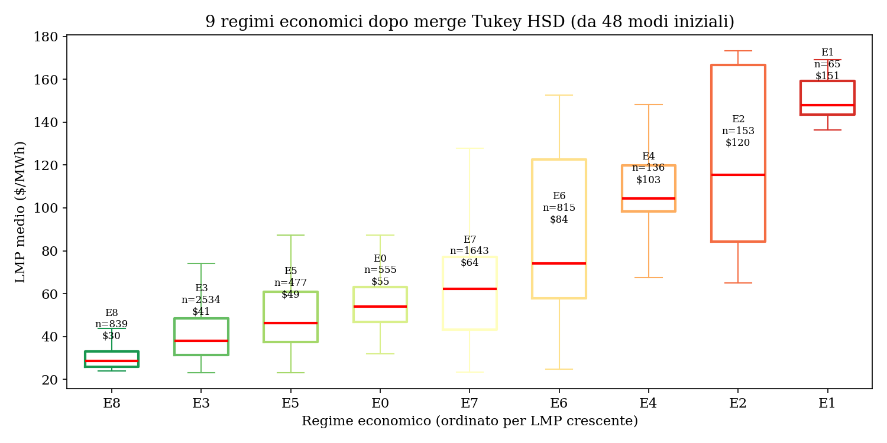
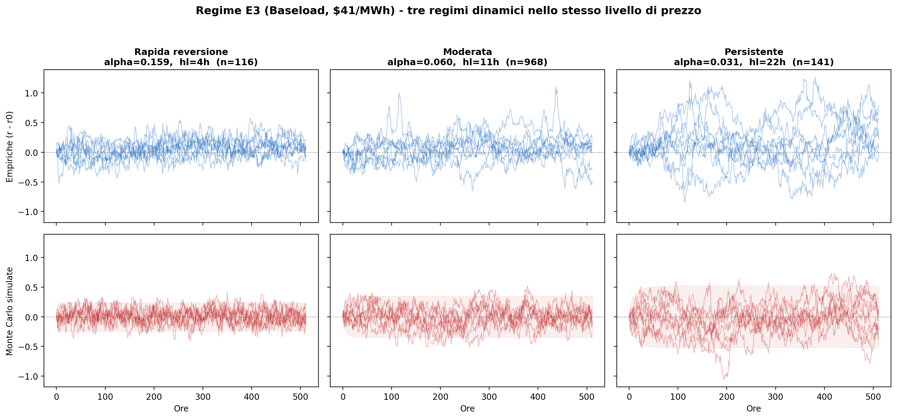

# Near-Orthogonal Regimes in ISO New England: Price Level and Temporal Persistence as Non-Redundant Dimensions

**Price level and temporal persistence as independent dimensions of market state**

C. Mari, C. Baldassari — Universita degli Studi della Tuscia, Viterbo, Italy

---

<p align="center">
  
</p>

<p align="center">
  <em>Each dot is a 512-hour window of ISO New England prices. The horizontal axis measures price level (LMP), the vertical axis measures temporal persistence (ACF at lag 6 h). All four quadrants are populated: knowing the price regime says almost nothing about the persistence regime, and vice versa.</em>
</p>

---

## Key finding

Electricity market regimes are organized along **two nearly orthogonal axes**, not one.

| Axis | Representation | What it captures | Regimes |
|------|---------------|-----------------|---------|
| **Economic** | 15 hand-crafted features on price increments | Price level (\$29 -- \$151 /MWh) | 9 (E0--E8) |
| **Dynamic** | MOMENT foundation model on residual levels | Temporal persistence (ACF 0.38 -- 0.94) | 9 (D0--D8) |

The two partitions have **ARI = 0.012** (essentially zero concordance): knowing the price regime tells you almost nothing about the persistence regime.

Within the same price regime, mean-reversion speed varies by a **factor of 5x** (half-life 4 h to 22 h) depending on the dynamic regime --- a heterogeneity invisible to any model that describes the market with a single state label.

## Evidence at a glance

<table>
<tr>
<td width="50%">

<br/><em>Each axis separates what the other cannot. (a) FE regimes produce a monotone price gradient. (b) MOMENT regimes do not separate price. (c) MOMENT regimes produce a monotone persistence gradient. (d) FE regimes do not separate persistence.</em>
</td>
<td width="50%">

<br/><em>Heatmap of the 9x9 regime grid. 70 of 81 cells are populated. If axes were redundant, mass would concentrate on the diagonal.</em>
</td>
</tr>
<tr>
<td width="50%">

<br/><em>Mean-reversion speed in joint (E, D) space. Green = fast reversion, red = persistent. The dynamic axis governs alpha (eta-squared 37.6%), not the economic axis (16.1%).</em>
</td>
<td width="50%">

<br/><em>Separation diagnostic. Price features cluster bottom-right (FE separates them), ACF features cluster top-left (MOMENT separates them). The diagonal pattern confirms two independent dimensions.</em>
</td>
</tr>
</table>

## Pipeline

```
LMP hourly (43,814 hours, 2021-2025)
  |
  arcsinh(p_t) --> MSTL (24h, 168h, 8760h) --> residual r_t
  |                                              |
  +--- Delta r_t (stationary) --> FE (15 features) --+
  |                                                    |
  +--- r_t (persistent) ----> MOMENT (1024-d emb.) --+
                                                       |
                              Diffusion Maps (d=2, d=5)
                                       |
                                  ToMATo clustering
                                       |
                              eta-squared diagnostic
                                       |
                                Tukey HSD merge
                                       |
                              9 Economic + 9 Dynamic regimes
                                       |
                                 ARI = 0.012
```

<p align="center">
  
</p>
<p align="center"><em>MSTL decomposition of arcsinh(LMP): trend, daily/weekly/annual seasonality, and residual r_t.</em></p>

<p align="center">
  
</p>
<p align="center"><em>Spectral gap of Diffusion Maps. FE: clear gap after lambda_2 (d=2). MOMENT: plateau through lambda_4, gap after lambda_4 (d=5).</em></p>

## Notebooks

Two Jupyter notebooks walk through the entire pipeline step by step:

| Notebook | Content |
|----------|---------|
| [`01_data_and_representations.ipynb`](notebooks/01_data_and_representations.ipynb) | Data loading, arcsinh transform, MSTL decomposition, residual analysis, sliding windows, Feature Engineering (15 features), MOMENT embedding |
| [`02_clustering_and_regimes.ipynb`](notebooks/02_clustering_and_regimes.ipynb) | Diffusion Maps, spectral gap, ToMATo clustering, eta-squared diagnostic, Tukey HSD merge, regime characterization, ARI, mean-reversion analysis, BIC model comparison |

## Quick start

### Requirements

```
python >= 3.10
numpy pandas scipy scikit-learn statsmodels
torch momentfm          # MOMENT foundation model (GPU recommended)
gudhi                   # ToMATo clustering
matplotlib seaborn      # visualization (notebooks)
```

Install:

```bash
pip install numpy pandas scipy scikit-learn statsmodels torch momentfm gudhi matplotlib seaborn
```

### Run the full pipeline

```bash
python pipeline_darcsinh/run_pipeline.py            # default: --mode split
```

The pipeline reads from `results/preprocessed.parquet` (output of the preprocessing step) and writes results to `results_darcsinh/split_W512_S6/`.

### Data

The dataset (`isone_dataset.parquet`) contains 43,814 hourly day-ahead LMP observations for the Massachusetts Hub of ISO New England (2021--2025), sourced from the [EIA Open Data API](https://api.eia.gov/v2/electricity/rto/wholesale-data) (`respondent=ISNE`, `type=D`).

## Repository structure

```
config.py                          # central configuration (window size, stride, model, features)
pipeline_darcsinh/
  run_pipeline.py                  # full dual-axis pipeline (preprocessing through model comparison)
notebooks/
  01_data_and_representations.ipynb
  02_clustering_and_regimes.ipynb
scripts/                           # auxiliary analysis scripts (robustness, figures, baselines)
figures/                           # key figures for this README
```

## Main results

| Metric | Value |
|--------|-------|
| Economic regimes (FE) | K_E = 9, price range \$29.7 -- \$151.1 /MWh |
| Dynamic regimes (MOMENT) | K_D = 9, ACF range 0.38 -- 0.94 |
| Cross-axis concordance | ARI = 0.012 |
| eta-squared FE on LMP mean | 0.495 |
| eta-squared MOMENT on ACF 6h | 0.420 |
| alpha range within E3 (Baseload) | 0.031 -- 0.159 (half-life 4 h -- 22 h) |
| Delta-BIC (two-axis vs one-axis) | -3,875 |
| Delta-BIC on volatility | -586 |
| GARCH eta-squared on D axis | ~0.02 (all 5 variants) |

<p align="center">
  
</p>
<p align="center"><em>Tukey HSD merge of the economic axis: 48 ToMATo modes collapse into 9 regimes with a clear price gradient.</em></p>

<p align="center">
  
</p>
<p align="center"><em>Same price regime (E3, Baseload, $41/MWh), three different dynamic regimes. Empirical windows (top) and Monte Carlo simulations (bottom). Half-life ranges from 4 h (left) to 22 h (right).</em></p>

## Citation

```bibtex
@article{mari2026near,
  title   = {Near-Orthogonal Regimes in {ISO New England}: Price Level and
             Temporal Persistence as Non-Redundant Dimensions},
  author  = {Mari, Carlo and Baldassari, Cristiano},
  year    = {2026},
  note    = {Working paper, Universit\`a degli Studi della Tuscia}
}
```

## License

MIT
